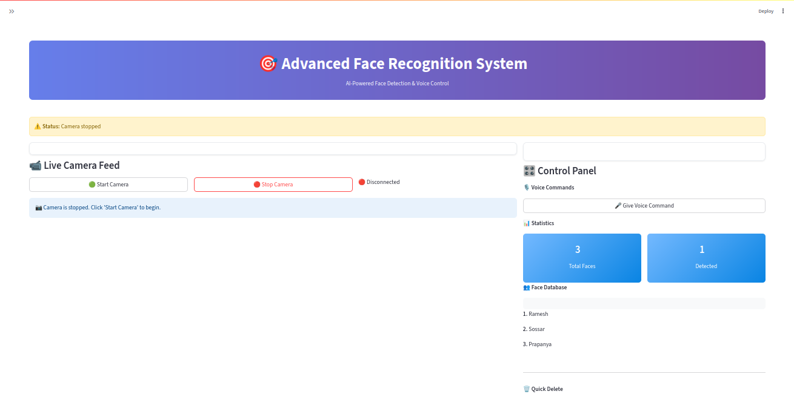
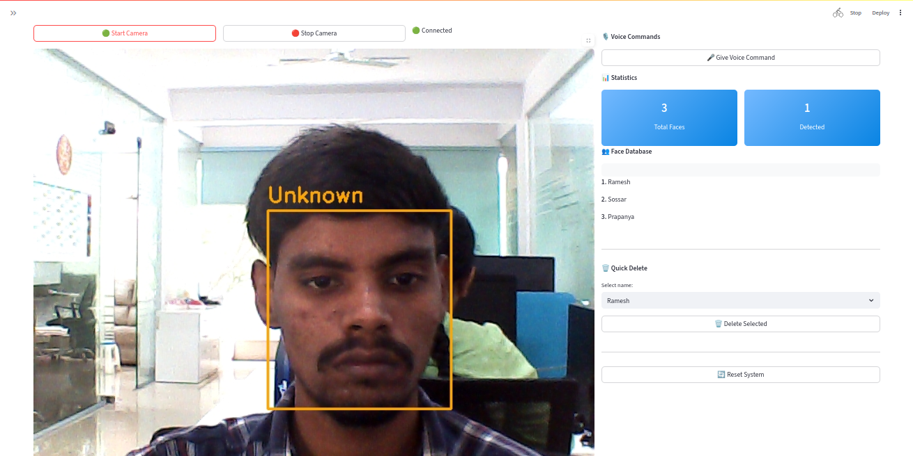

# 🎯 Advanced Face Recognition App

A Streamlit-based AI-powered **Face Recognition System** that uses voice commands, live webcam feed, and TTS for an interactive experience. It integrates real-time face detection and recognition with the ability to add or delete faces from a voice-controlled database.

---




---

## ✅ Platform Compatibility

This project is designed to run on:

- 💻 **Standard PC/Laptop (x86_64)**
- 🧠 **PhyCORE-i.MX8M Plus SOM** with **VeriSilicon VIP8000 NPU**

> ✅ The TFLite models are **INT8 quantized** and optimized to run with **VX Delegate** for hardware acceleration on VeriSilicon NPU.

---

## 🚀 Features

- 🔍 **Real-time face detection and recognition** using YOLO and FaceNet.
- 🎤 **Voice-controlled commands** to:
  - Add a new person
  - Delete a person
  - Stop camera
- 💬 **Text-to-Speech (TTS)** feedback using `pyttsx3`.
- 🗣️ **Speech-to-Text** via OpenAI's Whisper for accurate voice transcription.
- 🖼️ **Webcam support** for live feed and face operations.
- 🎛️ **Interactive Streamlit interface** with device selection panel.
- ⚡ **NPU acceleration** for face detection and recognition on i.MX8M Plus via **TFLite + VX Delegate**.

---

## 📦 Requirements

- Python 3.7+
- Linux-based OS (Ubuntu or Yocto-based)
- Webcam and microphone
- TFLite Models:
  - `yoloface_int8.tflite`
  - `facenet_512_int_quantized.tflite`

---

## 🔧 Installation

```bash
# Clone the repo
git clone https://github.com/12boopathi/Face_recognization_app.git
cd Face_recognization_app

# (Recommended) Create virtual environment
python3 -m venv venv
source venv/bin/activate

# Install dependencies
pip install -r requirements.txt
````

If `requirements.txt` is missing, install manually:

```bash
pip install streamlit opencv-python-headless pyttsx3 openai-whisper numpy
```

**Dependencies on system tools:**

```bash
sudo apt-get install ffmpeg libportaudio2 arecord aplay
```

> 🧠 On **PhyBoard-i.MX8M Plus**, make sure your environment includes `libvx_delegate.so` and NPU runtime libraries.

---

## 🧠 Model Setup

Place the following model files in the project root:

* `yoloface_int8.tflite` – Face detection (INT8 optimized)
* `facenet_512_int_quantized.tflite` – Face recognition (INT8 optimized)

> On i.MX8M Plus, these models are accelerated using **VeriSilicon VIP8000 NPU** via the **VX Delegate** interface in TFLite.

---

## 🎮 How to Use

```bash
streamlit run main.py
```

### Commands via Voice:

* **Add**: Add a new person
* **Delete**: Delete a person
* **Quit**: Stop the camera

### Manual Options:

* Start/Stop camera
* See detected faces and names
* Add/delete using GUI
* Select audio/video devices from sidebar

---

## 🎥 Devices & Audio

* Auto-detects available webcam (via OpenCV)
* Audio Input: Uses ALSA-compatible devices (`arecord`)
* Audio Output: Uses ALSA (`aplay` with `pyttsx3` generated WAV)

**Ensure microphone and speakers are configured using:**

```bash
arecord -l   # To list input devices
aplay -l     # To list output devices
```

---

## 📂 Project Structure

```text
.
├── main.py                      # Main Streamlit app
├── face_detection.py            # YOLO model wrapper
├── face_recognition.py          # FaceNet model wrapper
├── face_database.py             # Face DB management
├── yoloface_int8.tflite         # Face detection model (INT8)
├── facenet_512_int_quantized.tflite  # Face recognition model (INT8)
└── README.md
```

---

## 🛠 Troubleshooting

* **Microphone not working?** Check if `arecord` detects it.
* **No audio output?** Check your ALSA playback device and permissions.
* **No camera?** Make sure OpenCV can access your webcam (`/dev/video0`).
* **TFLite VX Delegate not working?** Check if NPU drivers and `libvx_delegate.so` are correctly installed.

---

## 📢 Acknowledgements

* [OpenAI Whisper](https://github.com/openai/whisper)
* [YOLO-Face](https://github.com/sthanhng/yoloface)
* [FaceNet TFLite Model](https://github.com/davidsandberg/facenet)
* [Streamlit](https://streamlit.io/)
* [VeriSilicon VIP8000 NPU](https://www.verisilicon.com/)

---

## 👤 Author

**Boobathi Karuppaiya**
🔗 [GitHub Profile](https://github.com/12boopathi)

